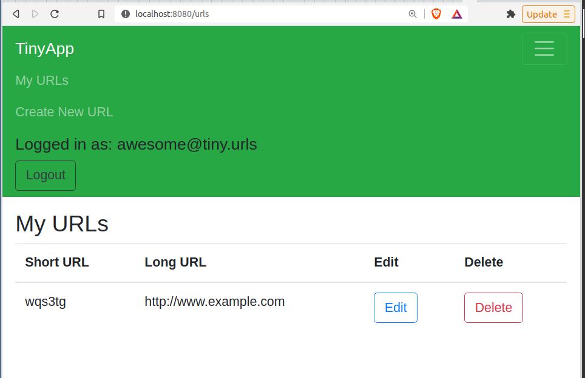
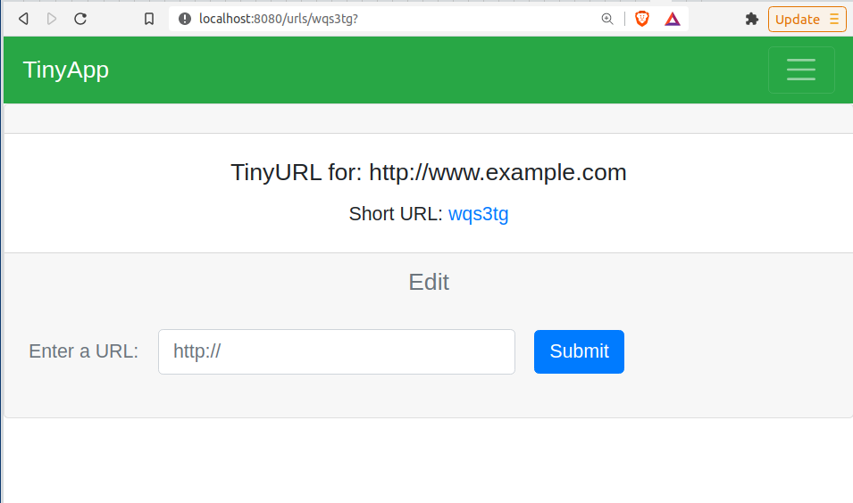
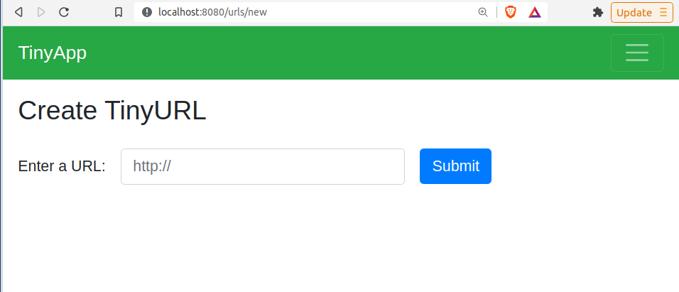

# TinyApp Project

TinyApp is a full stack web application built with Node and Express that allows users to shorten long URLs (à la bit.ly).

## Final Product

## Dependencies

- Node.js
- Express
- EJS
- bcrypt
- body-parser
- cookie-session

## Getting Started

- Install all dependencies (using the `npm install` command).

- Run the development web server using the `node express_server.js` command.

- Navigate to localhost:8080 and click on the register button, user information will be lost any time the server is restarted.

- Create new links in the drop down menu accessed in the upper right corner.

- Your urls will be saved and can be accessed through My Urls link also accessed through the upper right menu button.

- Only logged in users and creat, edit, or delete urls.